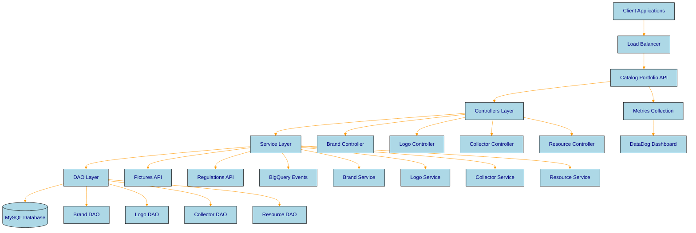

# Architecture Overview

Comprehensive guide to the Catalog Portfolio API service architecture, system design, and component interactions.

## System Overview

The Catalog Portfolio API service is a RESTful microservice built with Java and Spark framework, designed to manage brand information in RetailFlow's Catalog platform. It provides centralized brand management for the curated portfolio with high availability and scalability.

This section provides a comprehensive overview of the system architecture and design principles.

## Architecture Diagram

  <i class="fas fa-download"></i> Download Architecture Template

## Technology Stack

| Layer | Technology | Purpose |
|-------|------------|---------|
| **Framework** | Javalin | Lightweight REST API framework |
| **Dependency Injection** | Google Guice | Dependency management |
| **Database** | MySQL 8.0 | Primary data storage |
| **Build Tool** | Gradle 7.3 | Build automation |
| **JVM** | OpenJDK 17 | Runtime environment |
| **Metrics** | DataDog | Application monitoring |
| **Infrastructure** | RetailFlow | Deployment and orchestration |

## Key Architectural Principles

### 1. Layered Architecture
- **Controllers**: Handle HTTP requests and responses
- **Services**: Implement business logic and validations
- **DAOs**: Manage data access and persistence
- **Models**: Define data structures and entities

### 2. Separation of Concerns
- Clear boundaries between layers
- Single responsibility principle
- Loose coupling between components

### 3. Scalability
- Stateless service design
- Horizontal scaling capabilities
- Connection pooling for database access

### 4. Reliability
- Comprehensive error handling
- Circuit breaker patterns for external services
- Health checks and monitoring

## Component Interactions

### Brand Lifecycle Flow
1. **Brand Creation**: Client → Controller → Service → Validation → DAO → Database
2. **Logo Upload**: Client → Controller → Service → Pictures API → Database
3. **Brand Activation**: Client → Controller → Service → Validation → DAO → Database
4. **Brand Search**: Client → Controller → Service → DAO → Database

### External Integrations
- **Pictures API**: Logo storage and management
- **Regulations API**: Category and compliance validation
- **BigQuery**: Event streaming for analytics
- **DataDog**: Metrics and monitoring

## Performance Characteristics

- **Response Time**: < 100ms for typical operations
- **Throughput**: 1000+ requests per second
- **Availability**: 99.9% uptime SLA
- **Database Connections**: Pooled connections with circuit breakers
