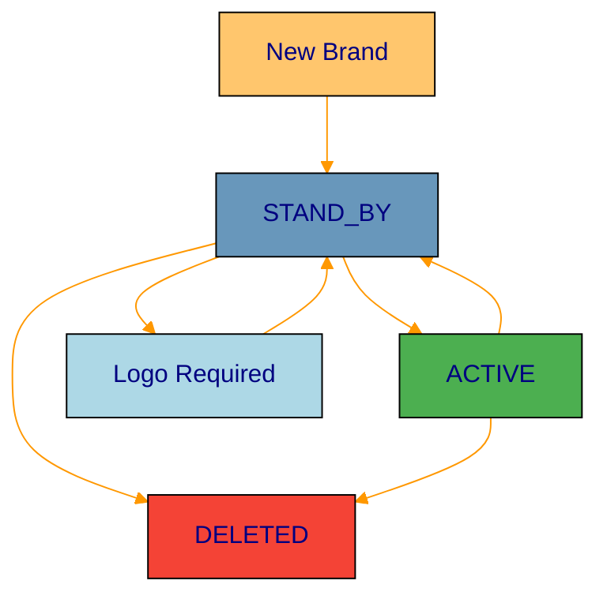

# Brand Management

Complete guide to brand lifecycle management, creation, updates, and activation processes in the Catalog Portfolio API service.

## Overview

Brand management is the core functionality of the Catalog Portfolio API service. This section covers all aspects of brand operations from creation to activation, including validation rules and business logic.

**Available Items:**

- [Brand Lifecycle](lifecycle.md) - Complete brand state management and transitions
- [Creating Brands](creation.md) - Step-by-step brand creation process
- [Brand Updates](updates.md) - Updating existing brand information
- [Brand Activation](activation.md) - Brand activation process and requirements
- [Brand Validation](validation.md) - Validation rules and business logic

## Brand Model


  <i class="fas fa-download"></i> Download Brand Model Template


A brand represents a merchant or company in the curated portfolio with the following structure:

```json
{
    "id": 2,
    "name": "McDonald's",
    "soft_descriptor": "MCDONALDS",
    "site": "MLB",
    "category": 5611201,
    "subcategories": [],
    "type": "lighthouse",
    "tags": [
        "611724878",
        "bf_mlb_2020"
    ],
    "logos": [
        {
            "id": 1290,
            "brand_id": 2,
            "type": "cover",
            "picture_id": "620688-MLA45741117352_042021"
        },
        {
            "id": 23,
            "brand_id": 2,
            "type": "main",
            "picture_id": "979677-MLA43159708639_082020"
        }
    ],
    "resources": [
        {
            "type": "card",
            "url": "https://http2.retailflow-static.com/storage/api-instore-resource/brand-041299f0-a3e0-4faa-a41f-8dd06784b5e3-card.png"
        },
        {
            "type": "pin",
            "url": "https://http2.retailflow-static.com/storage/api-instore-resource/brand-041299f0-a3e0-4faa-a41f-8dd06784b5e3-pin.png"
        }
    ],
    "priority": 9,
    "status": "ACTIVE",
    "date_created": "2019-11-25T17:17:24.000-04:00",
    "date_last_updated": "2021-06-10T13:17:10.000-04:00"
}
```

## Brand States

Brands can exist in three possible states:



### State Descriptions

- **STAND_BY**: Brand is created but not yet active. May be missing required logos or temporarily deactivated.
- **ACTIVE**: Brand is fully functional and visible in the system. All requirements are met.
- **DELETED**: Brand has been permanently removed (irreversible action).

## Key Business Rules

### Brand Creation Requirements
- **Name**: Must be unique within the site
- **Site**: Must be a valid RetailFlow site (MLA, MLB, MLC, etc.)
- **Category**: Must be a valid category ID from the regulations service
- **Type**: Must be either "lighthouse" or "standard"

### Brand Activation Requirements
- **Main Logo**: At least one main logo must be uploaded
- **Validation**: All business rules must pass validation
- **Category Compliance**: Must comply with regulations service requirements

### Brand Deletion Permissions
- **Authorization**: Requires client ID to be whitelisted
- **Irreversibility**: Deletion cannot be undone
- **Audit Trail**: Complete audit log is maintained

## Common Operations

### Creating a Brand
```bash
curl -X POST "https://api.mp.internal.retailflow.com/catalog/brands" \
  -H "Content-Type: application/json" \
  -d '{
    "name": "Example Brand",
    "site": "MLA",
    "category": 5611201,
    "type": "lighthouse"
  }'
```

### Updating a Brand
```bash
curl -X PUT "https://api.mp.internal.retailflow.com/catalog/brands/123" \
  -H "Content-Type: application/json" \
  -d '{
    "name": "Updated Brand Name",
    "priority": 10
  }'
```

### Activating a Brand
```bash
curl -X PUT "https://api.mp.internal.retailflow.com/catalog/brands/123/activate"
```

## Validation Rules

Before activation, brands must pass these validations:
- Main logo uploaded and processed
- Valid category and site combination
- Compliance with regulations service requirements
- All required fields populated

## Error Handling

Common errors and their meanings:
- `brand_not_found`: Brand ID does not exist
- `logos_missing`: Required logos not uploaded
- `validation_failed`: Business rules validation failed
- `unauthorized`: Missing permissions for the operation 