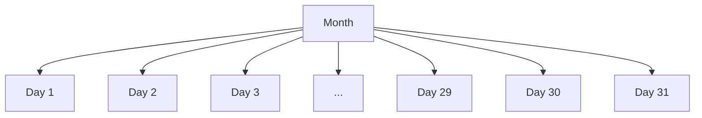

# Diarización

This section explains the dailyization of monthly exogenous variables.

## Notation

$N$ : number of timestamps

$M$ : number of exogenous features

$y(t)$ : timeseries real values at time $t$

$y_j(t)$ : timeseries real values at time $t$ for the $j$-th series ($j \in \{1, \ldots, N\}$)

$\tilde{y}(t)$ : forecasts for $y(t)$, before reconciliation

$\hat{y}(t)$ : forecasts for $y(t)$, after reconciliation

$X$ : matrix of exogenous variables 

$x_i$ : exogenous variable $i$

$X(t)$ : exogenous variables at time $t$

$x_i(t)$ : exogenous variable $i$ at time $t$

## Motivation

Although we use daily data, for some future exogenous variables we only have information at a monthly level. In order to use them in our models, we need to disaggregate them to a daily level. 

## Approach

Time-hierarchies can be seen as standard hierarchies. This can be easily visualized by the linear constraint of having the sum of daily values equal to the monthly value.

$$
\sum\limits_{t \in month} x_i(t) = x_i(t\in month)
$$

where $month$ is the set of days in the month. and $x_i(t\in month)$ is the value of the exogenous variable $i$ at that month.

This is not different of what we do in the hierarchical forecasting, where the sum of bottom levels must be equal to the total level forecast. Hence, we can use forecast reconciliation strategies to disaggregate the monthly values to a daily level.

In our particular case, we do not want just to reconcile - we want to reconcile and keep the total level (month level) input exactly before. The reconciliation should treat the month level as correct. There are two reconcilation strategies that accomplish this: top-down and forecast proportions. The problem of topdown is that it is not clear how it could be applied to this temporal hierarchy since months have different lengths, and Forecast Proportions seems to be the best option.

### Forecast proportions for temporal hierarchies

The approach is to use a base forecast $\tilde{x}_i$ of the exogenous variable for future dates, and re-scale the it so that the total of the month is the given total value $x_i(t\in month)$. The base total forecast for the month is

$$
\tilde{x}_{i}(t \in month) = \sum\limits_{t \in month} \tilde{x}_i(t) \cdot
$$

To reconcile the daily forecasts, we multiply them by the ratio of $x_i(t\in month)$ and $\tilde{x}_i(t \in month)$:

$$
\hat{x}_i(t) = \tilde{x}_i(t) \cdot \frac{x_i(t\in month)}{\tilde{x}_i(t \in month)}
$$

This reconciled forecast can then be used as an input for the model.

As a toy example, suppose that we receive from the responsible team that it will be invested 300 dollars in some mechanism such as rebates. In other words, $x_i(t \in month) = 300$. If our base forecasts for total of the month is 400 dollars ($\tilde{x}_i(t \in month) = 400$), we should re-scale them to that the total is 300 dollars, while using these base forecasts to compute the share of each day in the month. This could be achieved by multiplying the base forecasts of the given month by $300/400 = 0.75$.

## Implementation

The implementation can be found [in this file](https://github.com/retailcorpsrc/retail_demand-forecast/blob/6a6612004f7a329935f791777bf9b428cd307eac/src/marketplace/sktime/transformations/temporal_forecast_proportions.py#L4). 
