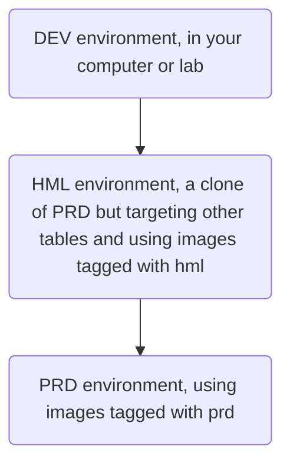
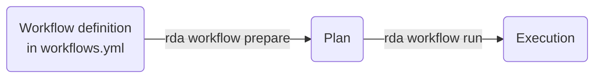
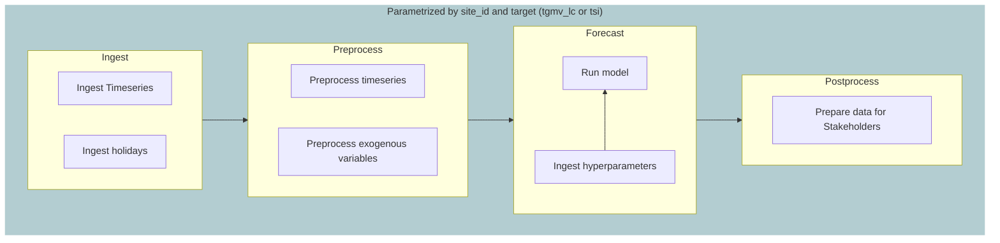

# Overview

> This documentation intends to explain how the project is organized and how to contribute to it, being more focused on developer experience.

Marketplace forecasting is a project that aims to forecast the demand of products in the marketplace, providing insights into TGMV and TSI for 9 product categories + total for each site.

# Getting to know our tooling

## **Git**

Git is used to do version control in the repo. We use the gitflow model to organize our branches, which is a simple convention to how we name our branches and how we merge them. The main branch is called "master", and the development branch is called "develop". We also have a "release" branch, which is used to test the code before merging it to master. The "hotfix" branch is used to fix bugs in the master branch. The "feature" branch is used to develop new features and merge them to develop.

For example, the process of adding a code and would be the following:

1. Create a branch from `develop` called `feature/your_functionality`, where _your_funcionality_ should be replaced with a name coherent with the changes being made. If the code is fixing something, the prefix should be `fix/`. To create a branch from develop, first, checkout to develop

```sh
git checkout develop
git pull
```

And create the new branch

```sh
git checkout -b feature/your_functionality
```

Add the changes, commit, and push them to your branch:

```sh
git push
```

Then, create a pull request in the project, and add your team and tech lead as reviewers. Then, merge the code.

2. Create a release branch and merge it with master. To do this, checkout to develop after the pull request being approved.

```sh

git checkout develop
git pull

```

Then create the release branch, upgrading the version from the previous release (you can ask your team or check the list of release/ branches in the github interfaces)
(Replace X.Y.Z with the proper version)

```sh
git checkout -b release/X.Y.Z
git push --set-upstream release/X.Y.Z
```

And do a PR from the github interface. Thanks to the release process created by RetailCorp, the approval will be automatic since you're merging from a release branch.


> [!NOTE]
> We haven't included above the steps to create the retail images. In this flow of feature -> develop -> release -> master branches, we can also create task-images to test the changes before deploying them to production. We will explain it in the RDF section


## Poetry

Poetry is used to manage the dependencies of the project. We use it to keep track of python library dependencies and to install local environments.
Poetry uses the `pyproject.toml` to identify which packages and versions it should install. Them, it saves all the info in a `poetry.lock` file.


### Installing current project

To install the current project and create a poetry env, run

```sh

poetry install
```

on the terminal. You should see that it has created a customized python environment for you. To run commands with this python, you can do `poetry run python --version`, for example


### Updating dependencies


To add or update packages, we can use the `poetry add package` command on the terminal. The package argument accepts some constraints specifications on the package version, for example `pandas@latest`, `"pandas>=2.0"`, `pandas<2.0`. 

```sh

poetry add pandas@latest
poetry add "pandas>=2.0"
poetry add "pandas<2.0"

```

> [!WARNING]
>When using those constraints, try to always use " " before and after the package specificacion because the terminal can mistake it with some special characters.


Avoid changing the versions in the `pyproject.toml` file directly, because when we do `poetry add`, poetry automatically takes care of the dependencies inter-dependencies.

### Poetry is awesome

Poetry has some problems but it is indeed an awesome library, because it helps managing the project and installs **your project as a package in a python environment**. If you run `poetry install`, then you can import the modules inside the `src/` folder as you would for a normal package. In the case of marketplace project:


```python
from marketplace.pipes.main import pipelines
```

Notice that app.pipes.main is a module inside this project src/.

It is important to always keep your python updated with Poetry, so that we ensure all team members are using the same environment.


> [!WARNING]
> If you have multiple directories inside the `src/` directory, don't forget adding them to pyproject.toml, otherwise poetry will not recognize.
> To do it, add them in the packages section, like so:  `packages = [{from="src", include="app"}]`

## **Retail Data Framework**

Retail Data Framework is used to build and deploy the project. It's a tool that wraps docker and kubernetes, and manages all projects here at RetailCorp. More specifically, we will use the Retail Data Application.


### **Retail Data Application (RDA)**

Its the core of all data science projects here at RetailCorp. With RDA, we can create projects, a git repository connected to it, jupyter labs, _task-images_, _tasks_, _workflows_ and _agendas_. Those last four are the most relevant.

- **Task-images** are frozen images of the code at the moment of creation - they point to a specific commit in the git repository. They are used to run tasks. The task-images are also defined by their entrypoint file, which will be executed later, and a set of input fields (artifacts and/or parameters) and outputs (artifacts). Those inputs are passed to the file through a library called rda-toolkit, developed by a specialized team at RetailCorp. We defined those tasks in a filed called ***tasks.yml***. This is the place to go to start reading the source code of the project.
- **Tasks** are the execution of a task-image. They are defined by a set of inputs and outputs, which are passed at the moment of execution.
- **Workflows** are a set of tasks that are executed sequentially. They are defined by the tasks-images that will be called, and their interdependencies. The workflows are defined in `workflows.yml`.
- **Agendas**: agendas are regular executions of workflows or task-images. They are defined by a cron expression, and the workflow or task-image that will be executed.


### Development environments

It's a good practice to separate the tables that we use for development purposes from the tables used in production. This help us test changes without affecting the forecasts we send to our internal clients. To do this, we create 3 environments (made by rules in the code that change which tables/artifacts we used): Development (DEV), Staging (HML) and  Production (PRD).




We separate the production environment from development and staging using the tags in retail task-images, and parameters in our code. The tag _dev_ is used for development and testing, _hml_ for staging, and _prd_ for production.

### Creating tasks

To create tasks, you should add its specifications to `tasks.yml` file, and then run `rda prepare`:

```sh
rda prepare my_task_in_tasks_yml --version 0.0.1
```

We can also add tags to the version. Indeed, we use it to differentiate development (DEV), staging (HML) and production (PRD) environments. If you are creating a package to be used locally, for some rapid tests, you can normally do the command above or add the _dev_ tag.

```sh

rda prepare my_task_in_tasks_yml --version 0.0.1-dev
```

If you want to test that code in a HML environment, do:

```sh

rda prepare my_tasks_in_tasks_yml --version 0.0.1-hml
```

Finally, to put it into production 

```sh

rda prepare my_tasks_in_tasks_yml --version 0.0.1-prd
```

"How does this tagging help us?" You may be asking. Well, with it, we can create to isolated environments "HML" and "PRD", and push the changes to affect "HML" before doing it to PRD. When defining the workflow in `workflows.yml`, we can specify the task version and tags. So, we will have two different workflows, one aiming at the staging (HML) task images and other to the production task images, that can (and maybe should) be always lagged with respected to the HML images. Let's dig into the workflows.

### Creating workflows


Workflows are specified in the workflows.yml file. They are defined by a set of tasks, and their interdependencies.
The usage of workflows follows three steps:



1. We first define the workflow at workflows.yml.
2. We run `rda workflow prepare` (also specifying some other parameters, such as the name and version), to create a **workflow plan**. The workflow plan is a frozen version of the workflow. It's the equivalent of a task-image for workflows. 3. We run a specific plan


One amazing feature of workflows  is the ability to parametrize them. For example, check this workflow with only one task inside:


```yml workflows.yml

monitoring_workflow:
    description: "Workflow that monitors the data"
    operations:
        monitor_data:
            description: "Operation to monitor data"
            task-image:
                name: "monitoring_pipeline"
                version: ">=0.0.1, {{ ENV }}"
                inputs:
                    runtime: 
                        env: "{{ ENV }}"
                        processing_date: "{{ WORKFLOW.TODAY_DATE }}"
                        ref_date: "{{ WORKFLOW.TODAY_DATE - 7 }}"          
```

This workflow has some variables inside `{{ }}`. They serve to parametrize the workflow. The `WORKFLOW.TODAY_DATE` is a special parameter provided automatically by Retail Data Framework, and it is replaced by the date value (YYYY.M.D) at the moment of creation of the workflow plan.

On the other hand, the `ENV` is a parameter that we define when we run the workflow. We can actually parametrize whatever we want, given that we provide a value at preparation time. For example:

```sh

rda workflow prepare monitoring_workflow --version 0.0.1 --user-param ENV:DEV
```

Now, check the version parameter in the workflow above. It specifies that this operation  uses the image `monitoring_pipeline` with version ">=0.0.1, {{ ENV }}"` which, by running with ENV:DEV, is interpreted as ">=0.0.1, DEV". This indicates that it will use the most recent image satisfying version  >=0.0.1 and having the tag "DEV". This is a very powerful feature, because it allows us to have different versions of the same task-image, and to run them in different environments (DEV, HML, PRD).


## The data pipelines

Now, let's understand the macro picture of the data pipeline. The data pipeline is divided into modules that are independent of each other, and each is responsible to a particular aspect of the data pipeline. We represent the data pipeline as a flowchat below:



The `Ingest` module is responsible for ingesting the timeseries and holidays data. The `Preprocess` module is responsible for preprocessing the timeseries and exogenous variables, by filling in missing dates and putting it into a dataframe in the right format for forecasting. The `Forecast` module is responsible for running the model and ingesting the hyperparameters. The `Postprocess` module is responsible for preparing the data for stakeholders, by creating the tables in the format we have agreed with them.

Each module is in a directory of our project. The ingest classes can be found at `src/app/pipes/ingest`. The preprocess classes can be found at `src/app/pipes/preprocessing`. The forecast classes can be found at `src/app/pipes/forecasting`. The postprocess classes can be found at `src/app/pipes/postprocessing`.


#### A more detailed view of the data pipeline

Below, we describe with more details each step of the data pipeline. Each yellow box is a class. The green boxes are datasets generated after the execution of a function (white boxes).

```mermaid

flowchart TD;
    subgraph IngestMarketplaceData
    step__get_data_from_bigquery[get_data_from_bigquery]
     end
    style step__get_data_from_bigquery fill: #fff
    subgraph IngestMarketplaceData
    dataset__si_query_dataframe[si_query_dataframe]
     end
    style dataset__si_query_dataframe fill: #ada
    subgraph IngestMarketplaceData
    step__make_series[make_series]
     end
    style step__make_series fill: #fff
    subgraph IngestMarketplaceData
    dataset__series[series]
     end
    style dataset__series fill: #ada
    subgraph HolidaysDatasetPipe
    step___get_campaigns_dummies[_get_campaigns_dummies]
     end
    style step___get_campaigns_dummies fill: #fff
    subgraph HolidaysDatasetPipe
    dataset__campaign_dummies[campaign_dummies]
     end
    style dataset__campaign_dummies fill: #ada
    subgraph HolidaysDatasetPipe
    step___get_intervening_dummies[_get_intervening_dummies]
     end
    style step___get_intervening_dummies fill: #fff
    subgraph HolidaysDatasetPipe
    dataset__intervening_dummies[intervening_dummies]
     end
    style dataset__intervening_dummies fill: #ada
    subgraph HolidaysDatasetPipe
    step___load_holidays[_load_holidays]
     end
    style step___load_holidays fill: #fff
    subgraph HolidaysDatasetPipe
    dataset__holidays_w_window[holidays_w_window]
     end
    style dataset__holidays_w_window fill: #ada
    subgraph HolidaysDatasetPipe
    dataset__holidays_wo_window[holidays_wo_window]
     end
    style dataset__holidays_wo_window fill: #ada
    subgraph HolidaysDatasetPipe
    step___preprocess_holidays[_preprocess_holidays]
     end
    style step___preprocess_holidays fill: #fff
    subgraph HolidaysDatasetPipe
    dataset__holidays_df[holidays_df]
     end
    style dataset__holidays_df fill: #ada
    subgraph PreprocessExogenous
    step__make_exog[make_exog]
     end
    style step__make_exog fill: #fff
    subgraph PreprocessExogenous
    dataset__X[X]
     end
    style dataset__X fill: #ada
    subgraph PreprocessTarget
    step__make_target[make_target]
     end
    style step__make_target fill: #fff
    subgraph PreprocessTarget
    dataset__y[y]
     end
    style dataset__y fill: #ada
    subgraph ProphetVerticalIniciativaPipeline
    step___get_vertical_hiperparams_from_table[_get_vertical_hiperparams_from_table]
     end
    style step___get_vertical_hiperparams_from_table fill: #fff
    subgraph ProphetVerticalIniciativaPipeline
    dataset__vertical_hyperparams[vertical_hyperparams]
     end
    style dataset__vertical_hyperparams fill: #ada
    subgraph ProphetVerticalIniciativaPipeline
    step__create_model[create_model]
     end
    style step__create_model fill: #fff
    subgraph ProphetVerticalIniciativaPipeline
    dataset__model[model]
     end
    style dataset__model fill: #ada
    subgraph ProphetVerticalIniciativaPipeline
    step__predict[predict]
     end
    style step__predict fill: #fff
    subgraph ProphetVerticalIniciativaPipeline
    dataset__preds[preds]
     end
    style dataset__preds fill: #ada
    subgraph ProphetVerticalIniciativaPipeline
    step__predict_components[predict_components]
     end
    style step__predict_components fill: #fff
    subgraph ProphetVerticalIniciativaPipeline
    dataset__pred_components[pred_components]
     end
    style dataset__pred_components fill: #ada
    subgraph ProphetVerticalIniciativaPipeline
    step__predict_intervals[predict_intervals]
     end
    style step__predict_intervals fill: #fff
    subgraph ProphetVerticalIniciativaPipeline
    dataset__intervals[intervals]
     end
    style dataset__intervals fill: #ada
    subgraph ProphetVerticalIniciativaPipeline
    step__train[train]
     end
    style step__train fill: #fff
    subgraph ProphetVerticalIniciativaPipeline
    dataset__fitted_model[fitted_model]
     end
    style dataset__fitted_model fill: #ada
    subgraph PostprocessPredictions
    step__compute_daily_preds[compute_daily_preds]
     end
    style step__compute_daily_preds fill: #fff
    subgraph PostprocessPredictions
    dataset__preds_daily[fa:fa-database preds_daily]
     end
    style dataset__preds_daily fill: #ada
    subgraph PostprocessPredictions
    step__compute_preds_monthly[compute_preds_monthly]
     end
    style step__compute_preds_monthly fill: #fff
    subgraph PostprocessPredictions
    dataset__preds_monthly[fa:fa-database preds_monthly]
     end
    style dataset__preds_monthly fill: #ada
    subgraph PostprocessPredictions
    step__compute_weekly_monday_preds[compute_weekly_monday_preds]
     end
    style step__compute_weekly_monday_preds fill: #fff
    subgraph PostprocessPredictions
    dataset__preds_weekly_monday[fa:fa-database preds_weekly_monday]
     end
    style dataset__preds_weekly_monday fill: #ada
    subgraph PostprocessPredictions
    step__compute_weekly_sunday_preds[compute_weekly_sunday_preds]
     end
    style step__compute_weekly_sunday_preds fill: #fff
    subgraph PostprocessPredictions
    dataset__preds_weekly_sunday[fa:fa-database preds_weekly_sunday]
     end
    style dataset__preds_weekly_sunday fill: #ada
    subgraph PostprocessPredictions
    step__merge_preds_with_components[merge_preds_with_components]
     end
    style step__merge_preds_with_components fill: #fff
    subgraph PostprocessPredictions
    dataset__preds_with_components[preds_with_components]
     end
    style dataset__preds_with_components fill: #ada
    step__get_data_from_bigquery --> dataset__si_query_dataframe;
    step__make_series --> dataset__series;
    step___get_campaigns_dummies --> dataset__campaign_dummies;
    step___get_intervening_dummies --> dataset__intervening_dummies;
    step___load_holidays --> dataset__holidays_wo_window;
    step___load_holidays --> dataset__holidays_w_window;
    step___preprocess_holidays --> dataset__holidays_df;
    step__make_exog --> dataset__X;
    step__make_target --> dataset__y;
    step___get_vertical_hiperparams_from_table --> dataset__vertical_hyperparams;
    step__create_model --> dataset__model;
    step__predict --> dataset__preds;
    step__predict_components --> dataset__pred_components;
    step__predict_intervals --> dataset__intervals;
    step__train --> dataset__fitted_model;
    step__compute_daily_preds --> dataset__preds_daily;
    step__compute_preds_monthly --> dataset__preds_monthly;
    step__compute_weekly_monday_preds --> dataset__preds_weekly_monday;
    step__compute_weekly_sunday_preds --> dataset__preds_weekly_sunday;
    step__merge_preds_with_components --> dataset__preds_with_components;
    dataset__si_query_dataframe --> step__make_series;
    dataset__series --> step__make_target;
    dataset__holidays_wo_window --> step___get_campaigns_dummies;
    dataset__holidays_wo_window --> step___get_intervening_dummies;
    dataset__campaign_dummies --> step__make_exog;
    dataset__intervening_dummies --> step__make_exog;
    dataset__holidays_w_window --> step___preprocess_holidays;
    dataset__holidays_df --> step__create_model;
    dataset__y --> step__make_exog;
    dataset__y --> step__create_model;
    dataset__y --> step__train;
    dataset__X --> step__predict;
    dataset__X --> step__predict_components;
    dataset__X --> step__predict_intervals;
    dataset__X --> step__train;
    dataset__vertical_hyperparams --> step__create_model;
    dataset__model --> step__train;
    dataset__fitted_model --> step__predict;
    dataset__fitted_model --> step__predict_components;
    dataset__fitted_model --> step__predict_intervals;
    dataset__preds --> step__merge_preds_with_components;
    dataset__pred_components --> step__merge_preds_with_components;
    dataset__preds_with_components --> step__compute_daily_preds;
    dataset__preds_with_components --> step__compute_preds_monthly;
    dataset__preds_with_components --> step__compute_weekly_monday_preds;
    dataset__preds_with_components --> step__compute_weekly_sunday_preds;
    style dataset__fitted_model fill: #ada
    dataset__fitted_model[fitted_model]
    style dataset__vertical_hyperparams fill: #ada
    dataset__vertical_hyperparams[vertical_hyperparams]
    style dataset__preds_weekly_monday fill: #ada
    dataset__preds_weekly_monday[fa:fa-database preds_weekly_monday]
    style dataset__preds_monthly fill: #ada
    dataset__preds_monthly[fa:fa-database preds_monthly]
    style step__predict fill: #fff
    step__predict[predict]
    style step__predict_intervals fill: #fff
    step__predict_intervals[predict_intervals]
    style dataset__y fill: #ada
    dataset__y[y]
    style step__make_series fill: #fff
    step__make_series[make_series]
    style step___get_campaigns_dummies fill: #fff
    step___get_campaigns_dummies[_get_campaigns_dummies]
    style dataset__pred_components fill: #ada
    dataset__pred_components[pred_components]
    style dataset__holidays_wo_window fill: #ada
    dataset__holidays_wo_window[holidays_wo_window]
    style dataset__campaign_dummies fill: #ada
    dataset__campaign_dummies[campaign_dummies]
    style dataset__preds fill: #ada
    dataset__preds[preds]
    style step__make_exog fill: #fff
    step__make_exog[make_exog]
    style step__train fill: #fff
    step__train[train]
    style step__compute_weekly_monday_preds fill: #fff
    step__compute_weekly_monday_preds[compute_weekly_monday_preds]
    style step__make_target fill: #fff
    step__make_target[make_target]
    style step__compute_preds_monthly fill: #fff
    step__compute_preds_monthly[compute_preds_monthly]
    style dataset__holidays_df fill: #ada
    dataset__holidays_df[holidays_df]
    style step__merge_preds_with_components fill: #fff
    step__merge_preds_with_components[merge_preds_with_components]
    style dataset__model fill: #ada
    dataset__model[model]
    style step___get_vertical_hiperparams_from_table fill: #fff
    step___get_vertical_hiperparams_from_table[_get_vertical_hiperparams_from_table]
    style dataset__holidays_w_window fill: #ada
    dataset__holidays_w_window[holidays_w_window]
    style dataset__intervals fill: #ada
    dataset__intervals[intervals]
    style dataset__si_query_dataframe fill: #ada
    dataset__si_query_dataframe[si_query_dataframe]
    style step__create_model fill: #fff
    step__create_model[create_model]
    style dataset__preds_daily fill: #ada
    dataset__preds_daily[fa:fa-database preds_daily]
    style dataset__intervening_dummies fill: #ada
    dataset__intervening_dummies[intervening_dummies]
    style step__get_data_from_bigquery fill: #fff
    step__get_data_from_bigquery[get_data_from_bigquery]
    style step___load_holidays fill: #fff
    step___load_holidays[_load_holidays]
    style dataset__series fill: #ada
    dataset__series[series]
    style step___get_intervening_dummies fill: #fff
    step___get_intervening_dummies[_get_intervening_dummies]
    style step__compute_weekly_sunday_preds fill: #fff
    step__compute_weekly_sunday_preds[compute_weekly_sunday_preds]
    style dataset__preds_weekly_sunday fill: #ada
    dataset__preds_weekly_sunday[fa:fa-database preds_weekly_sunday]
    style step__compute_daily_preds fill: #fff
    step__compute_daily_preds[compute_daily_preds]
    style dataset__X fill: #ada
    dataset__X[X]
    style dataset__preds_with_components fill: #ada
    dataset__preds_with_components[preds_with_components]
    style step___preprocess_holidays fill: #fff
    step___preprocess_holidays[_preprocess_holidays]
    style step__predict_components fill: #fff
    step__predict_components[predict_components]
```



#### Explicabilidad pipeline

The pipeline for explicabilidad is a little bit different from the others. It is represented below:

```mermaid
flowchart TD;
    subgraph IngestMarketplaceData
    step__get_data_from_bigquery[get_data_from_bigquery]
    style step__get_data_from_bigquery fill: #fff
    dataset__si_query_dataframe[si_query_dataframe]
    style dataset__si_query_dataframe fill: #ada
    step__make_series[make_series]
    style step__make_series fill: #fff
    dataset__series[series]
    style dataset__series fill: #ada
     end
    subgraph HolidaysDatasetPipe
    step___get_campaigns_dummies[_get_campaigns_dummies]
    style step___get_campaigns_dummies fill: #fff
    dataset__campaign_dummies[campaign_dummies]
    style dataset__campaign_dummies fill: #ada
    step___get_intervening_dummies[_get_intervening_dummies]
    style step___get_intervening_dummies fill: #fff
    dataset__intervening_dummies[intervening_dummies]
    style dataset__intervening_dummies fill: #ada
    step___load_holidays[_load_holidays]
    style step___load_holidays fill: #fff
    dataset__holidays_w_window[holidays_w_window]
    style dataset__holidays_w_window fill: #ada
    dataset__holidays_wo_window[holidays_wo_window]
    style dataset__holidays_wo_window fill: #ada
     end
    subgraph PreprocessTarget
    step__make_target[make_target]
    style step__make_target fill: #fff
    dataset__y[y]
    style dataset__y fill: #ada
     end
    subgraph PreprocessExplicabilidadInputs
    step__make_exog[make_exog]
    style step__make_exog fill: #fff
    dataset__X[X]
    style dataset__X fill: #ada
    dataset__dailyization_transformer[dailyization_transformer]
    style dataset__dailyization_transformer fill: #ada
    step__preprocess_input_investment_variables[preprocess_input_investment_variables]
    style step__preprocess_input_investment_variables fill: #fff
    dataset__X_explicabilidad[X_explicabilidad]
    style dataset__X_explicabilidad fill: #ada
    step__preprocess_plans[preprocess_plans]
    style step__preprocess_plans fill: #fff
    dataset__preprocessed_plans[preprocessed_plans]
    style dataset__preprocessed_plans fill: #ada
     end
    subgraph PreprocessExogenous
    step__make_holidays_dataframe[make_holidays_dataframe]
    style step__make_holidays_dataframe fill: #fff
    dataset__holidays_df[holidays_df]
    style dataset__holidays_df fill: #ada
     end
    subgraph ProphetverseVerticalForecastingPipeline
    step__create_model[create_model]
    style step__create_model fill: #fff
    dataset__model[model]
    style dataset__model fill: #ada
    step__get_fh[get_fh]
    style step__get_fh fill: #fff
    dataset__fh[fh]
    style dataset__fh fill: #ada
    step__predict[predict]
    style step__predict fill: #fff
    dataset__preds[preds]
    style dataset__preds fill: #ada
    step__predict_decomposition[predict_decomposition]
    style step__predict_decomposition fill: #fff
    dataset__preds_with_components[preds_with_components]
    style dataset__preds_with_components fill: #ada
    step__predict_intervals[predict_intervals]
    style step__predict_intervals fill: #fff
    dataset__intervals[intervals]
    style dataset__intervals fill: #ada
     end
    subgraph ProphetVerticalIniciativaPipeline
    step__train[train]
    style step__train fill: #fff
    dataset__fitted_model[fitted_model]
    style dataset__fitted_model fill: #ada
     end
    subgraph PostprocessPredictionsLongFormat
    step__aggregate_monthly[aggregate_monthly]
    style step__aggregate_monthly fill: #fff
    dataset__preds_monthly_long[fa:fa-database preds_monthly_long]
    style dataset__preds_monthly_long fill: #ada
    step__aggregate_weekly[aggregate_weekly]
    style step__aggregate_weekly fill: #fff
    dataset__preds_weekly_monday_long[fa:fa-database preds_weekly_monday_long]
    style dataset__preds_weekly_monday_long fill: #ada
    dataset__preds_weekly_sunday_long[fa:fa-database preds_weekly_sunday_long]
    style dataset__preds_weekly_sunday_long fill: #ada
    step__passthrough_daily_long[passthrough_daily_long]
    style step__passthrough_daily_long fill: #fff
    dataset__preds_daily_long_to_table[fa:fa-database preds_daily_long_to_table]
    style dataset__preds_daily_long_to_table fill: #ada
    step__pred_components_to_long[pred_components_to_long]
    style step__pred_components_to_long fill: #fff
    dataset__preds_daily_long[preds_daily_long]
    style dataset__preds_daily_long fill: #ada
     end
    step__get_data_from_bigquery --> dataset__si_query_dataframe;
    step__make_series --> dataset__series;
    step___get_campaigns_dummies --> dataset__campaign_dummies;
    step___get_intervening_dummies --> dataset__intervening_dummies;
    step___load_holidays --> dataset__holidays_w_window;
    step___load_holidays --> dataset__holidays_wo_window;
    step__make_target --> dataset__y;
    step__make_exog --> dataset__X;
    step__make_exog --> dataset__dailyization_transformer;
    step__make_holidays_dataframe --> dataset__holidays_df;
    step__preprocess_input_investment_variables --> dataset__X_explicabilidad;
    step__preprocess_plans --> dataset__preprocessed_plans;
    step__create_model --> dataset__model;
    step__get_fh --> dataset__fh;
    step__predict --> dataset__preds;
    step__predict_decomposition --> dataset__preds_with_components;
    step__predict_intervals --> dataset__intervals;
    step__train --> dataset__fitted_model;
    step__aggregate_monthly --> dataset__preds_monthly_long;
    step__aggregate_weekly --> dataset__preds_weekly_monday_long;
    step__aggregate_weekly --> dataset__preds_weekly_sunday_long;
    step__passthrough_daily_long --> dataset__preds_daily_long_to_table;
    step__pred_components_to_long --> dataset__preds_daily_long;
    dataset__si_query_dataframe --> step__make_series;
    dataset__series --> step__make_target;
    dataset__campaign_dummies --> step__make_exog;
    dataset__intervening_dummies --> step__make_exog;
    dataset__holidays_w_window --> step__make_holidays_dataframe;
    dataset__holidays_wo_window --> step___get_campaigns_dummies;
    dataset__holidays_wo_window --> step___get_intervening_dummies;
    dataset__y --> step__make_exog;
    dataset__y --> step__preprocess_input_investment_variables;
    dataset__y --> step__train;
    dataset__X --> step__get_fh;
    dataset__X --> step__predict;
    dataset__X --> step__predict_intervals;
    dataset__X --> step__train;
    dataset__X --> step__pred_components_to_long;
    dataset__holidays_df --> step__make_exog;
    dataset__holidays_df --> step__create_model;
    dataset__X_explicabilidad --> step__make_exog;
    dataset__preprocessed_plans --> step__make_exog;
    dataset__model --> step__train;
    dataset__fh --> step__predict;
    dataset__fh --> step__predict_decomposition;
    dataset__fh --> step__predict_intervals;
    dataset__preds_with_components --> step__pred_components_to_long;
    dataset__fitted_model --> step__predict;
    dataset__fitted_model --> step__predict_decomposition;
    dataset__fitted_model --> step__predict_intervals;
    dataset__preds_daily_long --> step__aggregate_monthly;
    dataset__preds_daily_long --> step__aggregate_weekly;
    dataset__preds_daily_long --> step__passthrough_daily_long;
    dataset__explicabilidad_inputs --> step__preprocess_input_investment_variables;
    dataset__explicabilidad_planes --> step__preprocess_plans;
    style dataset__dailyization_transformer fill: #ada
    dataset__dailyization_transformer[dailyization_transformer]
    style dataset__series fill: #ada
    dataset__series[series]
    style step__make_holidays_dataframe fill: #fff
    step__make_holidays_dataframe[make_holidays_dataframe]
    style dataset__model fill: #ada
    dataset__model[model]
    style dataset__preds_weekly_monday_long fill: #ada
    dataset__preds_weekly_monday_long[fa:fa-database preds_weekly_monday_long]
    style dataset__preds_daily_long_to_table fill: #ada
    dataset__preds_daily_long_to_table[fa:fa-database preds_daily_long_to_table]
    style dataset__intervals fill: #ada
    dataset__intervals[intervals]
    style step__predict_intervals fill: #fff
    step__predict_intervals[predict_intervals]
    style dataset__X_explicabilidad fill: #ada
    dataset__X_explicabilidad[X_explicabilidad]
    style step___get_intervening_dummies fill: #fff
    step___get_intervening_dummies[_get_intervening_dummies]
    style dataset__preds fill: #ada
    dataset__preds[preds]
    style step__get_fh fill: #fff
    step__get_fh[get_fh]
    style dataset__preds_with_components fill: #ada
    dataset__preds_with_components[preds_with_components]
    style dataset__y fill: #ada
    dataset__y[y]
    style step__create_model fill: #fff
    step__create_model[create_model]
    style dataset__preds_monthly_long fill: #ada
    dataset__preds_monthly_long[fa:fa-database preds_monthly_long]
    style step__make_series fill: #fff
    step__make_series[make_series]
    style step__predict fill: #fff
    step__predict[predict]
    style step__predict_decomposition fill: #fff
    step__predict_decomposition[predict_decomposition]
    style dataset__campaign_dummies fill: #ada
    dataset__campaign_dummies[campaign_dummies]
    style dataset__holidays_w_window fill: #ada
    dataset__holidays_w_window[holidays_w_window]
    style step__get_data_from_bigquery fill: #fff
    step__get_data_from_bigquery[get_data_from_bigquery]
    style dataset__preprocessed_plans fill: #ada
    dataset__preprocessed_plans[preprocessed_plans]
    style dataset__holidays_df fill: #ada
    dataset__holidays_df[holidays_df]
    style step__aggregate_weekly fill: #fff
    step__aggregate_weekly[aggregate_weekly]
    style step__preprocess_input_investment_variables fill: #fff
    step__preprocess_input_investment_variables[preprocess_input_investment_variables]
    style step__train fill: #fff
    step__train[train]
    style dataset__preds_weekly_sunday_long fill: #ada
    dataset__preds_weekly_sunday_long[fa:fa-database preds_weekly_sunday_long]
    style step___get_campaigns_dummies fill: #fff
    step___get_campaigns_dummies[_get_campaigns_dummies]
    style step__aggregate_monthly fill: #fff
    step__aggregate_monthly[aggregate_monthly]
    style dataset__holidays_wo_window fill: #ada
    dataset__holidays_wo_window[holidays_wo_window]
    style step___load_holidays fill: #fff
    step___load_holidays[_load_holidays]
    style dataset__fh fill: #ada
    dataset__fh[fh]
    style dataset__fitted_model fill: #ada
    dataset__fitted_model[fitted_model]
    style dataset__si_query_dataframe fill: #ada
    dataset__si_query_dataframe[si_query_dataframe]
    style step__preprocess_plans fill: #fff
    step__preprocess_plans[preprocess_plans]
    style dataset__explicabilidad_planes fill: #ada
    dataset__explicabilidad_planes[explicabilidad_planes]
    style dataset__intervening_dummies fill: #ada
    dataset__intervening_dummies[intervening_dummies]
    style step__make_target fill: #fff
    step__make_target[make_target]
    style step__make_exog fill: #fff
    step__make_exog[make_exog]
    style dataset__X fill: #ada
    dataset__X[X]
    style step__passthrough_daily_long fill: #fff
    step__passthrough_daily_long[passthrough_daily_long]
    style dataset__explicabilidad_inputs fill: #ada
    dataset__explicabilidad_inputs[fa:fa-database explicabilidad_inputs]
    style dataset__preds_daily_long fill: #ada
    dataset__preds_daily_long[preds_daily_long]
    style step__pred_components_to_long fill: #fff
    step__pred_components_to_long[pred_components_to_long]
```



### Using the pipelines from notebook

First, be sure that you have installed the project with poetry.

**Ingesting data**


To ingest data, it's really simple. In your notebook, import the ingest pipe, pass the parameters and run.


```python

from marketplace.pipes.ingest.ingest_timeseries import IngestMarketplaceData
pipe = IngestMarketplaceData(site_id="RAB", target="tsi")
pipe.run()
pipe.catalog.load("series")
```

Another way to run it is by passing the parameters through a context:


```python

from retailpipes import Context
from marketplace.pipes.ingest.ingest_timeseries import IngestMarketplaceData
pipe = IngestMarketplaceData()

# With context, we can reuse the same object to ingest different datasets
with Context(site_id="RAB", target="tsi"):
    pipe.run()
    display(pipe.catalog.load("series"))

with Context(site_id="RAC", target="tgmv_lc"):
    pipe.run()
    display(pipe.catalog.load("series"))

```


**Ingest holidays data**

Similarly, to load holiday data, you can use the HolidaysDatasetPipe:

```python

from marketplace.pipes.ingest.holidays_and_campaigns import HolidaysDatasetPipe
pipe = HolidaysDatasetPipe(site_id="RAB", forecast="MKP_site")
pipe.run()
pipe.catalog.load("holidays_df"), pipe.catalog.load("campaign_dummies")

```

**Run the forecasting**

To run the forecasting, we have to use other pipelines together with the ingestion steps. We will use `PreprocessExogenous` and `PreprocessTarget`. These steps will prepare the data to be used in the forecasting pipeline. The forecasting pipeline is `ProphetVerticalIniciativaPipeline`.

We also pass some other parameters to the context. The forecast horizon parameter "fh" is used both for preprocessing and forecasting. The processing date parameter "processing_date" is used for preprocessing. The method parameter is used for forecasting, and can be "td_fcst" for Forecast Proportions reconciliaciion, "bu" for Bottom Up and "td_share" for a naive Topdown.

```python

from retailpipes import Context
from marketplace.pipes.ingest import HolidaysDatasetPipe, IngestMarketplaceData
from marketplace.pipes.forecasting.vertical_iniciativa_pipeline import (
    ProphetVerticalIniciativaPipeline,
)
from marketplace.pipes.preprocessing import PreprocessExogenous, PreprocessTarget

pipe =  (
    IngestMarketplaceData() 
    + HolidaysDatasetPipe() 
    + PreprocessExogenous() 
    + PreprocessTarget()
    + ProphetVerticalIniciativaPipeline()
    )


with Context(
         site_id="RAB",
         target="tsi",
         processing_date="2023-10-20",
         fh=100,
         method="bu"):
    pipe.run()

preds = pipe.catalog.load("preds")

```


## A deeper dive in how retailpipes is used with Retail Data Framework

If you take a look at the `src/app/pipes/main.py`, you will see a dictionary of pipelines mapping names to pipeline classes and the creation of a catalog. This catalog is a mapping between names and dataset classes. The names are outputs or inputs of steps in the pipelines (the green boxes in the figures above). Those are the key ingredients here. Let's understand how they talk with retail and each other.


In the Retail Data Framework's tasks.yml file, we have to pass an entrypoint informing which file are we willing to execute.  On the cloud, retail will do something like `python <entrypoint file>`, executing what is inside it. We can then access the parameters passed in the task through `retailtk.rda2` library. Note how cumbersome it would be to have to create a new file for every new parameter or task we have...

To overcome it, we have an "orchestrate" function, which, according to the parameter "pipeline_name" passed in `tasks.yml`, executes a specific pipeline. Then, we can use a single file for all tasks (and in some cases the same task-image), which simplifies the process of deploying.

The other key ingredient is the catalog. The catalog receives a dictionary of dataset names and dataset classes and handle all the saving/loading. In marketplace, the datasets are defined in a yml file. You can search the names of the datasets to see which pipelines are generating them in the code. 

In the examples above, we aren't passing a catalog to the pipeline, because it is optional. By default, we save the datasets in memory. To save on bigquery, you should do:


```python

from retailpipes.rda.datasets import BigQueryTable
from marketplace.pipes.main import catalog
from retailpipes import Context, Pipeline
from marketplace.pipes.ingest import HolidaysDatasetPipe, IngestMarketplaceData
from marketplace.pipes.forecasting.vertical_iniciativa_pipeline import (
    ProphetVerticalIniciativaPipeline,
)
from marketplace.pipes.preprocessing import PreprocessExogenous, PreprocessTarget

pipe =  (

    IngestMarketplaceData(catalog=catalog) 
    + HolidaysDatasetPipe() 
    + PreprocessExogenous() 
    + PreprocessTarget()
    + ProphetVerticalIniciativaPipeline()
    )


with Context(
         site_id="RAB",
         target="tsi",
         processing_date="2023-10-20",
         fh=100,
         method="bu"):
    pipe.run()

```
