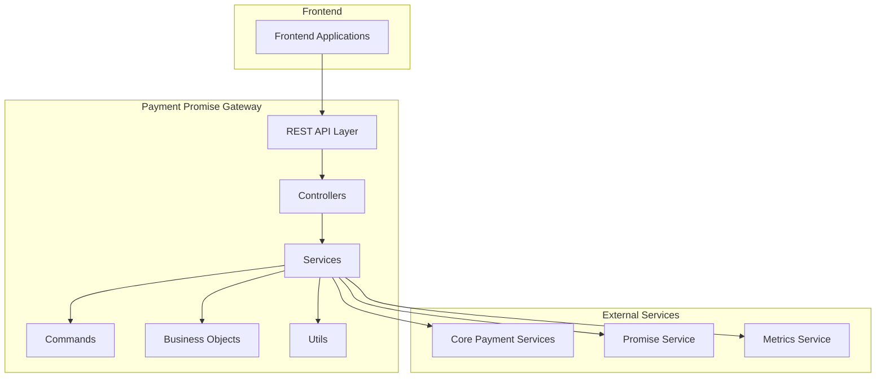
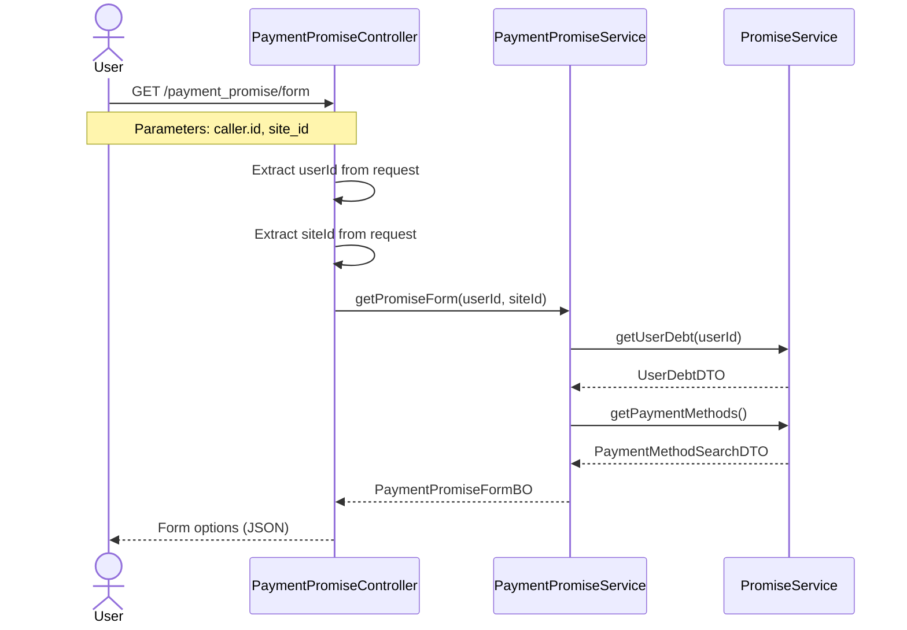
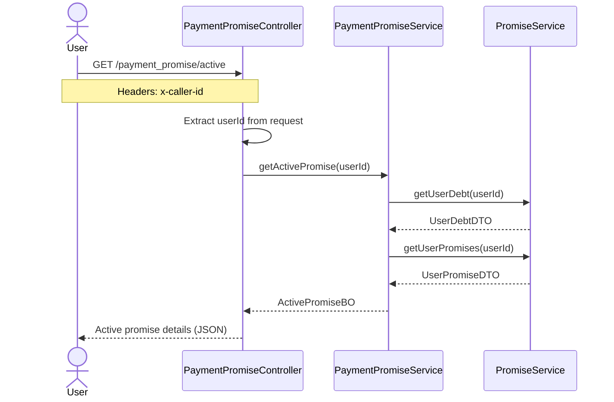
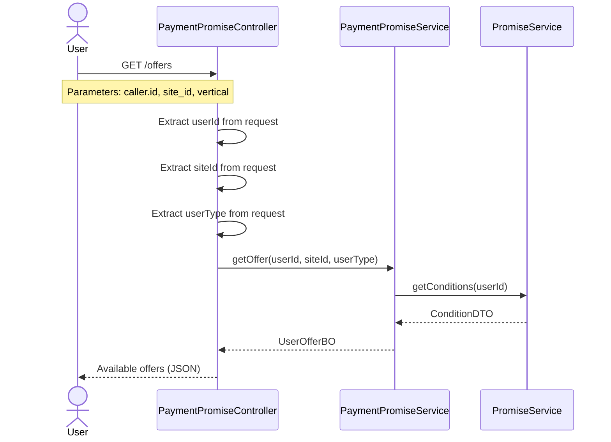
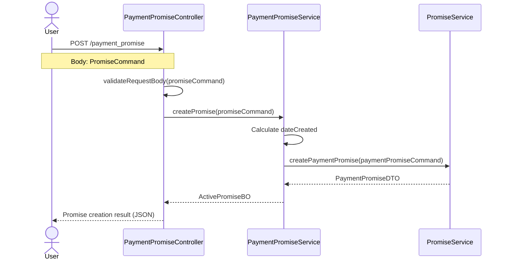
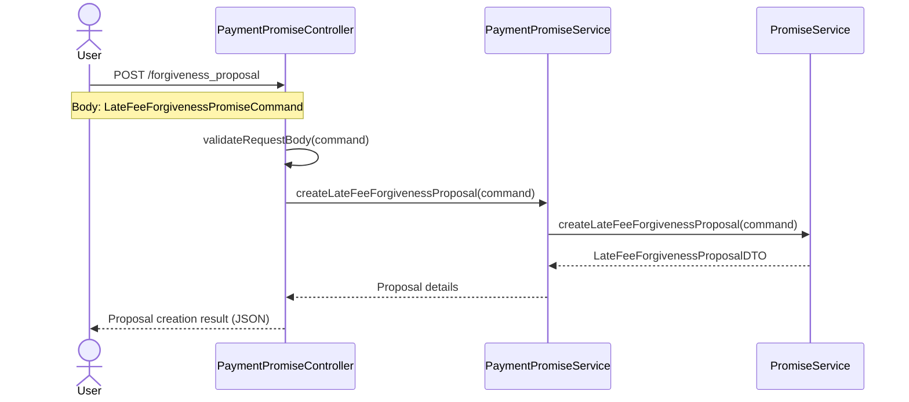
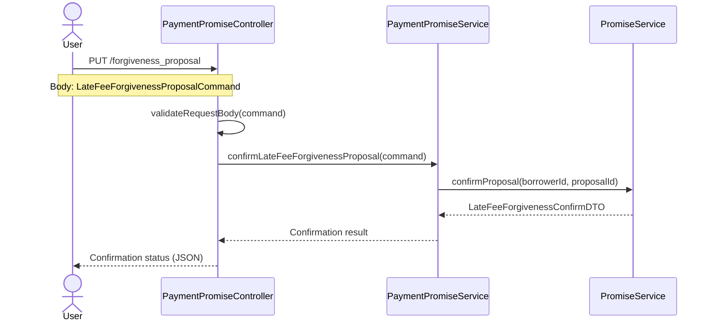
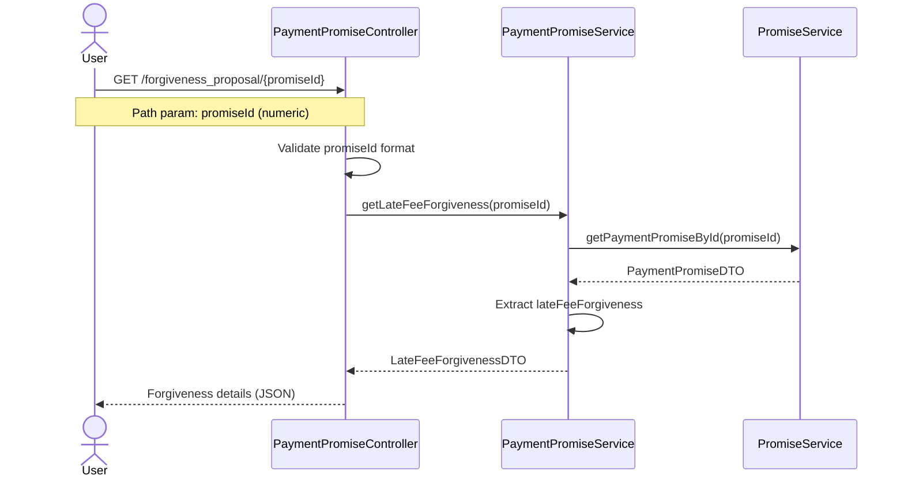

# Payment Promise Gateway

A middleware service that handles payment-related self-service operations for GreatMart's payment system. This service acts as an intermediary layer between the frontend applications and the core payment services.

## Architecture Overview



## Technical Stack

- **Language**: Java 17
- **Framework**: Spring Boot 3.2.4
- **Build Tool**: Gradle
- **Dependency Injection**: Google Guice
- **Documentation**: OpenAPI/Swagger
- **Monitoring**: DataDog Metrics

## Project Structure

```
src/main/java/com/greatmart/payments/selfservice/
├── config/          # Configuration classes
├── controller/      # REST controllers
├── entities/        # Domain entities
│   ├── bo/         # Business Objects
│   ├── commands/   # Command objects
│   └── workflowconfig/ # WorkflowCloud configuration
├── exceptions/      # Custom exceptions
├── metrics/         # Metrics collectors
├── services/        # Business logic
└── utils/          # Utility classes
```

## Design Patterns

1. **Command Pattern**
   - Used for encapsulating request parameters
   - Examples: `PromiseCommand`, `LateFeeForgivenessCommand`

2. **Builder Pattern**
   - Used in Business Objects construction
   - Examples: `ActivePromiseBO.Builder`

3. **Dependency Injection**
   - Using Google Guice for dependency management
   - Spring's `@Autowired` and Guice's `@Inject`

4. **Factory Pattern**
   - Used in service creation and configuration

5. **DTO Pattern**
   - Used for data transfer between layers
   - Examples: `LateFeeForgivenessDTO`, `UserDebtDTO`

## Main Features

### Payment Promises
- Create payment promises
- Get active promises
- Query promise forms and options
- Handle late fee forgiveness

### Late Fee Management
- Create forgiveness proposals
- Confirm forgiveness proposals
- Query forgiveness status

### Offers Management

- Retrieves the offers or remedies available to the user. Shows the different options the user has to regularize their debt.

## API Documentation

The API is documented using OpenAPI/Swagger. Main endpoints:

1. `GET /payment_promise/form`
2. `GET /payment_promise/active`
3. `GET /offers`
4. `POST /payment_promise`
5. `POST /forgiveness_proposal`
6. `PUT /forgiveness_proposal`
7. `GET /forgiveness_proposal/{promiseId}`

Detailed API documentation can be found in [specs-hub](https://web.workflowcloud.io/payment-promise-gateway/specs-hub).

## Sequence Diagrams

This section provides sequence diagrams for each API endpoint, showing the interaction flow between system components.

### 1. GET /payment_promise/form
**Description**: Retrieves the form options for payment promises. This endpoint allows querying available payment methods and permitted amounts.



### 2. GET /payment_promise/active
**Description**: Retrieves the user's active payment promise. Returns the promise details if an active one exists.



### 3. GET /offers
**Description**: Retrieves the offers or remedies available to the user. Shows the different options the user has to regularize their debt.



### 4. POST /payment_promise
**Description**: Creates a new payment promise. Allows the user to establish a payment commitment with a specific date and method.



### 5. POST /forgiveness_proposal
**Description**: Creates a late fee forgiveness proposal. Allows initiating the process of forgiving late payment interest.



### 6. PUT /forgiveness_proposal
**Description**: Confirms an existing late fee forgiveness proposal. Finalizes the forgiveness process previously initiated.



### 7. GET /forgiveness_proposal/{promiseId}
**Description**: Retrieves the details of a specific late fee forgiveness. Allows querying the status and details of an existing forgiveness.



### Endpoint Summary

1. **GET /payment_promise/form**
   - Used to obtain available options for the payment promise form
   - Requires user identification and site identification
   - Useful for the initial configuration of the promise form

2. **GET /payment_promise/active**
   - Queries the user's active payment promise
   - Only requires user identification
   - Allows verifying if the user has an active promise

3. **GET /offers**
   - Retrieves offers or remedies available to the user
   - Considers user ID, site, and user type
   - Allows displaying customized options according to the user's profile

4. **POST /payment_promise**
   - Creates a new payment promise
   - Requires a PromiseCommand object with promise details
   - Validates the data before creating the promise

5. **POST /forgiveness_proposal**
   - Creates a late fee forgiveness proposal
   - Uses LateFeeForgivenessPromiseCommand for details
   - Allows initiating the forgiveness process

6. **PUT /forgiveness_proposal**
   - Confirms an existing forgiveness proposal
   - Requires LateFeeForgivenessProposalCommand for confirmation
   - Finalizes the forgiveness process

7. **GET /forgiveness_proposal/{promiseId}**
   - Queries the details of a specific forgiveness
   - Validates that the promise ID is numeric
   - Returns detailed information about the forgiveness in DTO format

## API Examples

Below are examples of how to interact with the API using curl commands:

```bash
#!/bin/bash

# Common variables
BASE_URL="http://localhost:8080/payments/self-service"
AUTH_TOKEN="your-bearer-token"

# 1. GET /payment_promise/form
# Gets the form options for payment promises
curl -X GET "${BASE_URL}/payment_promise/form" \
  -H "Authorization: Bearer ${AUTH_TOKEN}" \
  -H "Content-Type: application/json" \
  --data-urlencode "caller.id=24517" \
  --data-urlencode "site_id=nta"

# 2. GET /payment_promise/active
# Gets the user's active payment promise
curl -X GET "${BASE_URL}/payment_promise/active" \
  -H "Authorization: Bearer ${AUTH_TOKEN}" \
  -H "Content-Type: application/json" \
  -H "x-caller-id: 24517" \
  --data-urlencode "caller.id=24517"

# 3. GET /offers
# Gets available offers for the user
curl -X GET "${BASE_URL}/offers" \
  -H "Authorization: Bearer ${AUTH_TOKEN}" \
  -H "Content-Type: application/json" \
  --data-urlencode "caller.id=24517" \
  --data-urlencode "site_id=ntb" \
  --data-urlencode "vertical=consumer"

# 4. POST /payment_promise
# Creates a new payment promise
curl -X POST "${BASE_URL}/payment_promise" \
  -H "Authorization: Bearer ${AUTH_TOKEN}" \
  -H "Content-Type: application/json" \
  -d '{
    "borrowerId": 987654321,
    "amount": 1000.50,
    "siteId": "NTA",
    "paymentMethod": "CREDIT_CARD",
    "dateCreated": "2025-05-12T15:54:43-05:00",
    "datePaid": "2025-05-15T15:54:43-05:00",
    "originEntity": "SELF_SERVICE"
  }'

# 5. POST /forgiveness_proposal
# Creates a late fee forgiveness proposal
curl -X POST "${BASE_URL}/forgiveness_proposal" \
  -H "Authorization: Bearer ${AUTH_TOKEN}" \
  -H "Content-Type: application/json" \
  -d '{
    "borrowerId": 987654321,
    "amount": 500.75,
    "siteId": "NTA"
  }'

# 6. PUT /forgiveness_proposal
# Confirms a late fee forgiveness proposal
curl -X PUT "${BASE_URL}/forgiveness_proposal" \
  -H "Authorization: Bearer ${AUTH_TOKEN}" \
  -H "Content-Type: application/json" \
  -d '{
    "borrowerId": 987654321,
    "proposalId": 123456789,
    "siteId": "NTA"
  }'

# 7. GET /forgiveness_proposal/{promiseId}
# Gets the late fee forgiveness information for a specific promise
curl -X GET "${BASE_URL}/forgiveness_proposal/7741596914" \
  -H "Authorization: Bearer ${AUTH_TOKEN}" \
  -H "Content-Type: application/json"
```

## Example Responses

```json
# GET /payment_promise/form Response:
{
  "bulk_amount": 18996.54,
  "payment_methods": [
    {
      "method_name": "CASH",
      "max_allowed": 18996.54,
      "min_allowed": 0.1
    },
    {
      "method_name": "DEBIT",
      "max_allowed": 18996.54,
      "min_allowed": 0.1
    },
    {
      "method_name": "ACCOUNT_MONEY",
      "max_allowed": 18996.54,
      "min_allowed": 0.1
    }
  ]
}

# GET /payment_promise/active Response:
{
  "promise": {
    "id": 7741596914,
    "amount": 2500.00,
    "site_id": "NTB",
    "payment_method": "CASH",
    "date_created": "2020-01-01T00:00:00.000-00:00",
    "paid_date": "2020-01-06T00:00:00.000-00:00",
    "due_date": "2020-01-08T00:00:00.000-00:00"
  },
  "partial_payment": false,
  "vertical": "consumer"
}

# GET /offers Response:
{
  "available_offers": [
    "payment_not_credited",
    "create_agreement",
    "create_debt_relief"
  ],
  "promise_due_date": null,
  "amount": null,
  "promise_id": null,
  "late_fee_forgiveness_id": null,
  "proposal_creation_status": "allowed"
}

# POST /payment_promise Response:
{
  "promise": {
    "id": 7741596914,
    "amount": 1000.00,
    "site_id": "NTB",
    "payment_method": "CASH",
    "date_created": "2020-09-23T00:00:00.000-00:00",
    "paid_date": "2020-09-23T00:00:00.000-00:00",
    "due_date": "2020-09-23T00:00:00.000-00:00"
  },
  "partial_payment": false,
  "vertical": "consumer"
}

# POST /forgiveness_proposal Response:
{
  "id": 1,
  "borrower_id": 743589216,
  "debt_amount": 939.52,
  "discount_amount": 12.48,
  "remaining_amount": 927.04,
  "due_date": "2020-10-13T00:00:00",
  "installments": [
    8094566,
    8099974,
    8099975,
    8099978
  ]
}

# PUT /forgiveness_proposal Response:
{
  "success": true
}

# GET /forgiveness_proposal/{promiseId} Response:
{
  "id": 1,
  "borrower_id": 743589216,
  "debt_amount": 939.52,
  "discount_amount": 12.48,
  "remaining_amount": 927.04,
  "due_date": "2020-10-13T00:00:00",
  "installments": [
    8094566,
    8099974,
    8099975,
    8099978
  ]
}
```

## Running the app
- You need to set `SCOPE=dev` or `SCOPE=local` environment variable to be able to run the project locally.
- Add in the field VM OPTIONS inIntelliJ right click on Main.java / Modify Run Configuration... / Modify options / Add VM options

-DconfigFileName=src/test/resources/application.properties -DchecksumEnabled=false -Djava.rmi.server.hostname=localhost

## Setup and Installation

1. Prerequisites:
   - Java 17
   - Gradle

2. Build the project:
   ```bash
   ./gradlew build
   ```

3. Run the application:
   ```bash
   ./gradlew bootRun
   ```

## Testing

Run the tests using:
```bash
./gradlew test
```

## Metrics and Monitoring

The application uses DataDog for metrics collection. Key metrics:
- Promise creation success/failure rates
- Forgiveness proposal statistics
- API response times
- Error rates

## Error Handling

The service implements a standardized error handling approach:
- HTTP status codes for API responses
- Detailed error messages
- Custom exceptions for business logic
- Consistent error format in responses

## Contributing

1. Follow the existing code structure
2. Maintain consistent error handling
3. Update API documentation when changing endpoints
4. Add appropriate unit tests
5. Use the existing design patterns

## License

This project is proprietary software owned by GreatMart.
