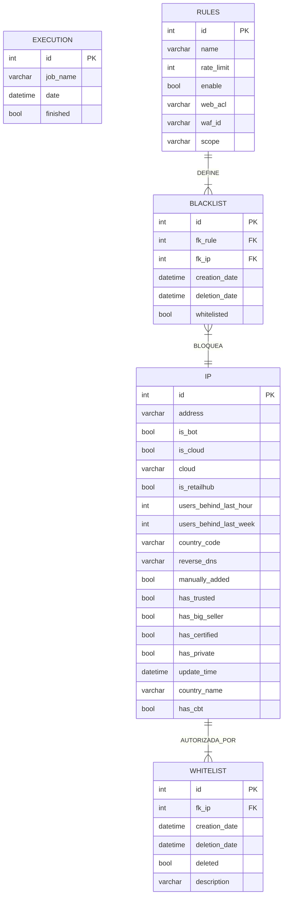

# Base de datos

La base de datos de Traffic Gate consta de 5 tablas:

- **Tabla Execution**: En esta tabla se guarda el estado de los jobs que hacen los llamados a los endpoints de la API de traffic-gate. Se guarda el nombre del job, fecha y el estado de la ejecución. *En el momento solo se está guardando el estado de los jobs que llaman a /whitelist. Las ejecuciones desde el job de /whitelist/purge no se están guardando*
  
- **Tabla Blacklist**: En esta tabla se guardan las direcciones ip que se encuentran bloqueadas por alguna regla de una Web ACL del WAF. Cuando traffic-gate determina que alguna de estas ips no deben ser bloqueadas, entonces notifica a trunks para enviar la ip a la whitelist y actualiza la columna 'whitelisted' a true
  
- **Tabla Whitelist**: En esta tabla se guardan las direcciones ip que se envían a una whitelist en las reglas del WAF. Después de cierto tiempo, se determina mediante un proceso de purga, si la ip debe continuar autorizada en la whitelist o si ya se puede remover de la misma. Cuando se determina que una ip ya no debe pertenecer a una whitelist, se hace un borrado lógico en base de datos, actualizando el campo 'deleted' en true.
  
- **Tabla Rules**: En esta tabla se guardan las reglas que están configuradas en el WAF y que están asociadas a alguna Web_ACL para bloqueo por límite máximo de tráfico. En toda la aplicación de Traffic Gate, solo se consultan estas reglas en el endpoint de /whitelist (func WhitelistJob). Lo que se hace es consultar las reglas asociadas a algún scope (front, api, pci, global_pci) y retornar la información de tales reglas con la WEB_ACL asociada. *No existe ningún controlador, ni servicio ni dao asociado a esta tabla, lo cual implica que cualquier cambio en las reglas se configura manualmente.*
  
- **Tabla IP**: En esta tabla se guarda toda la información relacionada a una dirección IP, que se emplea para determinar si tal dirección debe seguir siendo bloqueada por límite de tráfico o si se debe desbloquear y agregar a una whitelist.

## Diagrama Entidad Relación
Sequence Diagram:

