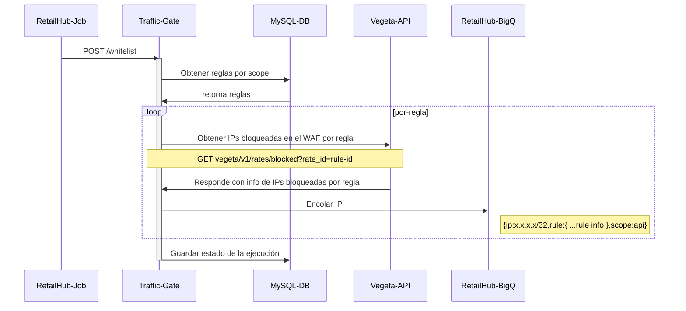

# Procesos de Whitelist y Purga

## Encolamiento de IPs Bloqueadas por Ratelimit

Este proceso se ejecuta desde el llamado al endpoint POST /whitelist desde un job configurado en RetailHub. Este servicio realiza la siguiente secuencia de acciones:

1. Obtener de la base de datos, las reglas habilitadas (enable = true) y asociadas a un Web_ACL en el WAF, para un scope dado (front, api, pci, pci_global). El scope es ingresado como query param según el job que realice el llamado.
   
2. Por cada una de las reglas obtenidas en el paso anterior, consulta a Vegeta al endpoint *rates/blocked?rate_id* para obtener las IPs bloqueadas por una regla específica, enviando como parámetro el ID de la regla. Vegeta a su vez obtiene esta información consultando el proceso [GetRateBasedStatementManagedKeys](https://docs.aws.amazon.com/sdk-for-go/api/service/wafv2/#WAFV2.GetRateBasedStatementManagedKeys) que expone la API WAFv2 de AWS.
   
3. Por cada una de las direcciones IP bloqueadas de cada ratelimit, se realiza un envío a una cola de mensajes con la información de la IP. La cola es una Big-Queue configurada en RetailHub. El mensaje se envía al tópico process-blocks.traffic-gate-api y la estructura del mensaje es como sigue:

```json
{
    "ip": "x.x.x.x/32",
    "rule": {
        "ID": 25,
        "Name": "RATE_SUSPECT_COUNTRIES_REST",
        "WafID": "SUSPECT_COUNTRIES_REST",
        "WebAcl": "WAF_WACL_FRONT_REST"
    },
    "scope": "front"
}
```


4. Se guarda el estado de la ejecución de esta tarea, incluyendo un valor lógico si la operación fue exitosa o no y el scope recibido. Esta actualización se realiza sobre la tabla execution.




## Procesamiento de IPs y Whitelist

Este se ejecuta desde el endpoint POST /whitelist/process, el cual recibe los mensajes desde el tópico process-blocks.traffic-gate-api de MegaQueue que fueron encolados desde el job de whitelist. Una vez recibida la dirección IP, calcula el CIDR (Dirección IP con el prefijo de la máscara) mediante el uso de una librería y busca en la base de datos información sobre dicha dirección IP. Esta información tiene todo el contexto del análisis que pudo haberse hecho recientemente, como por ejemplo si cumple alguna de las reglas de negocio de RetailHub (IsBot, IsRetailHub, IsCloud, IsTrusted, Big Seller, CBT), si tiene aplicaciones privadas o certificadas detrás del usuario (Application API), y la cantidad de usuarios que tuvo detrás en la última hora y en la última semana (Users Behind API). 

En caso de que no exista en la base de datos información sobre la dirección IP en cuestión, se procede a realizar un análisis por parte de Traffic Gate para obtener más contexto sobre esa dirección IP y así poder saber si debe ser enviada a whitelist o no.

En primer lugar se realiza un reverse DNS a la dirección IP para obtener su procedencia, se utiliza una librería de go llamada geoip2, para obtener información sobre la ciudad y el país al que pertenece dicha dirección IP.

Luego pasamos a verificar las reglas de negocio de RetailHub:

- Primero se envía a IsRetailHub API para saber si la dirección IP pertenece a infraestructura RetailHub.
  
- Se buscan los usuarios detrás de la dirección IP mediante Users Behind API.

- Mediante la información obtenida por Users Behind API se puede saber si esa la dirección IP pertenece a un usuario nominal o a un usuario aplicativo, de ser el caso aplicativo, se consulta a Application API para obtener contexto sobre esa aplicación (si es una aplicación privada, si es certificada, etc..).
  
- Si detrás de la dirección IP hay usuarios nominales, se revisa con User Reputation API (User Analysis) si es Big Seller o si es CBT (cross border trader).
  
- Mediante User Reputation API se consulta la reputación del usuario, puede ser sospechoso o confiable.
  
- Luego, se consulta la aplicación IsBot API para saber si detrás de la dirección IP hay un bot considerado bueno para RetailHub.
  
- Finalmente se consulta si la dirección IP pertenece a algún cloud provider determinado con IsCloud API.

Luego de hacer estas validaciones, se guarda en la base de datos toda esta información con el contexto y también indicando que el procesamiento de esta dirección IP está en ejecución (este estado cambia una vez terminado el proceso de whitelist, ya que si durante la ejecución llega la misma dirección IP a analizar se identifica que es un duplicado y que ya está en proceso de whitelist).

Una vez obtenida toda la información necesaria para la dirección IP, pasamos a la fase de decisión en la que se decide si la dirección IP debe ser enviada a whitelist o debe permanecer bloqueada. En esta parte es muy importante el scope que se haya enviado en la request al comenzar todo el flujo, ya que dependiendo del scope que sea (Front, PCI, API, PCI Global) se tienen en cuenta distintos criterios para enviar a whitelist una dirección IP [ver criterios por scope](/README?id=criterios-de-whitelist-por-scope)

Finalmente, se realiza un último chequeo contra la base de datos para saber si la dirección IP ya había sido enviada a whitelist antes, y en caso negativo, se envía a Vegeta API al ednpoint POST /v1/whitelist para ser agregada a whitelist.

Por último, se actualiza en la base de datos la información de la dirección IP con el estado whitelisted en true.

## Proceso de purga
Este proceso es ejecutado periódicamente desde un job configurado en RetailHub, para hacer un llamado cada hora al endpoint POST /whitelist/purge, y se encarga de actualizar la metadata de las direcciones IP actualmente en whitelist para determinar cuál de ellas debería dejar de estar en whitelist.

Debido a que las direcciones IP son dinámicas y los usuarios detrás de ellas van cambiando, esto genera que continuamente se valide si alguna dirección iP tiene que ser agregada a whitelist o por el contrario removida. 

A diferencia del flujo de procesamiento, este proceso trabaja con concurrencia, debido a la gran cantidad de direcciones IP a procesar; es por eso, que se crea una serie de workers ([goroutines]((https://go.dev/tour/concurrency/1)) que se ejecutan concurrentemente) y también un semáforo, el cual funciona como bloqueante para el resto del flujo, hasta que no se hayan procesado todas las direcciones IP.

En primer lugar cada dirección IP pasa por un proceso de actualización de su metadata, esto quiere decir que se vuelve a realizar toda la validación de los criterios por scope y se actualiza en la base de datos. Luego se verifica si la dirección IP tiene que permanecer en whitelist o no con la información que se acaba de obtener. En caso afirmativo, no se toma ninguna acción adicional; en caso contrario, se envía la dirección IP a Vegeta API al endpoint DETELE /v1/whitelist para que sea borrada de los ipsets correspondientes.
