#Use cases

Fresh products API documentation - sequence diagrams

POST /fresh-products/inboundorder
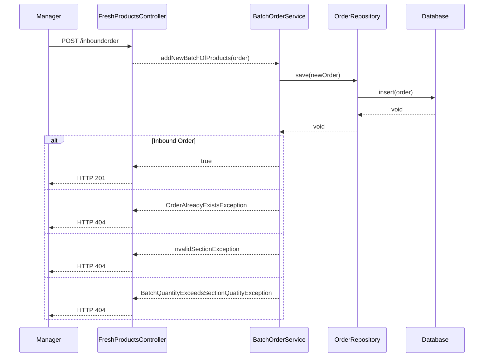

PUT /fresh-products/inboundorder

GET /fresh-products
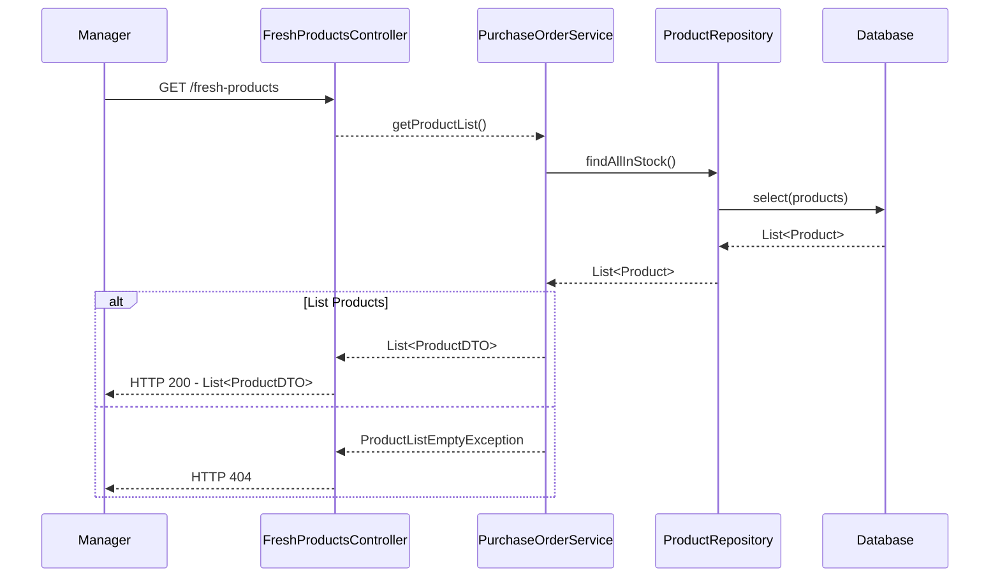

GET /fresh-products/list-category{category}
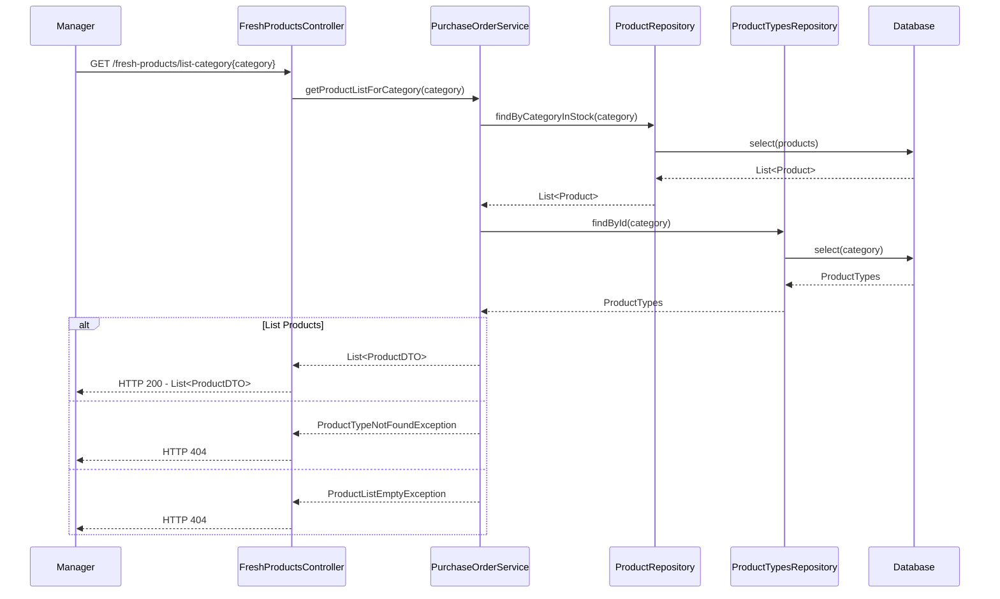

POST /orders
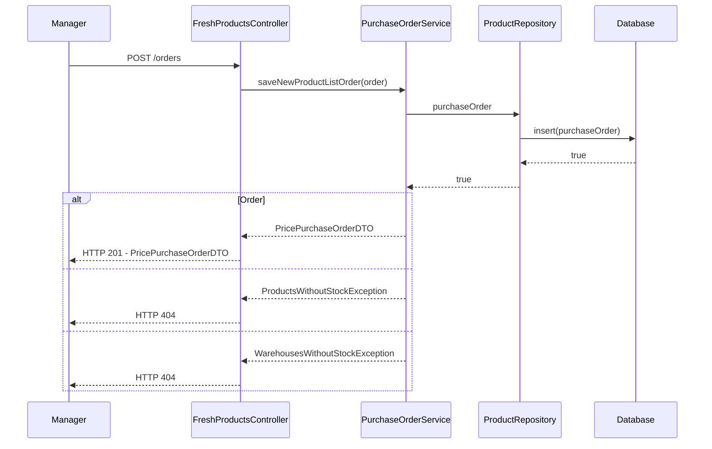

GET /orders
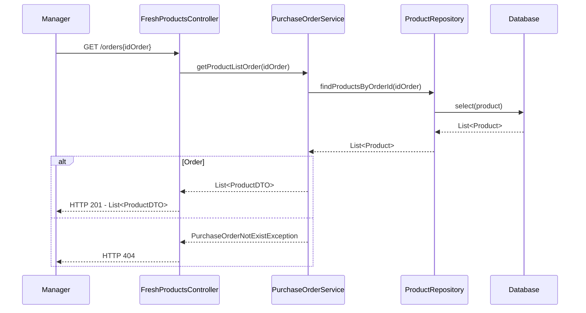

PUT /orders

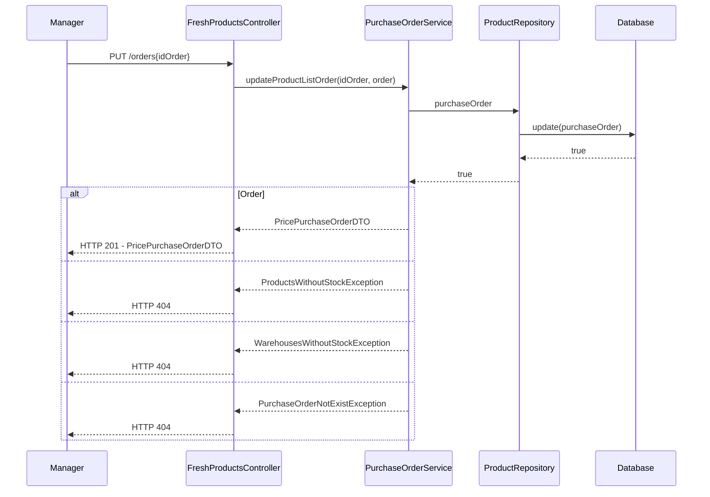

GET /fresh-products/list{productId}
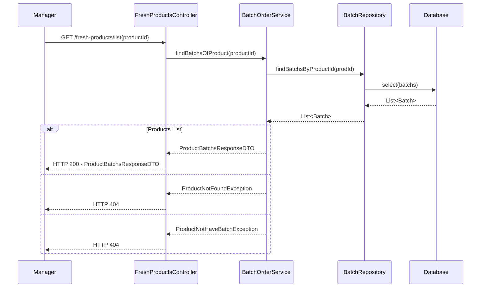

GET /fresh-products/list/{productId}/{sort}
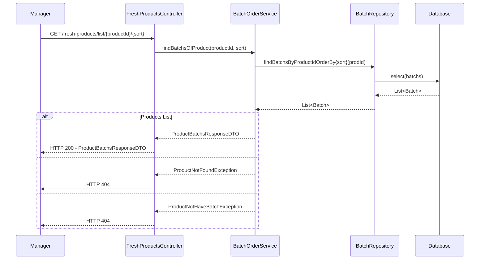

GET /warehouse{productId}
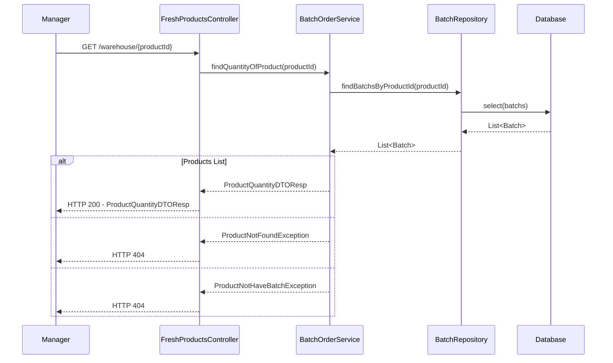

GET /due-date/{quantityOfDays}
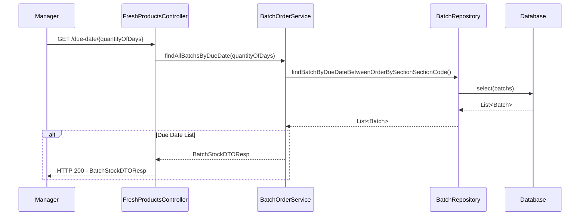

GET /due-date/list{quantityOfDays}/{category}/{sort}
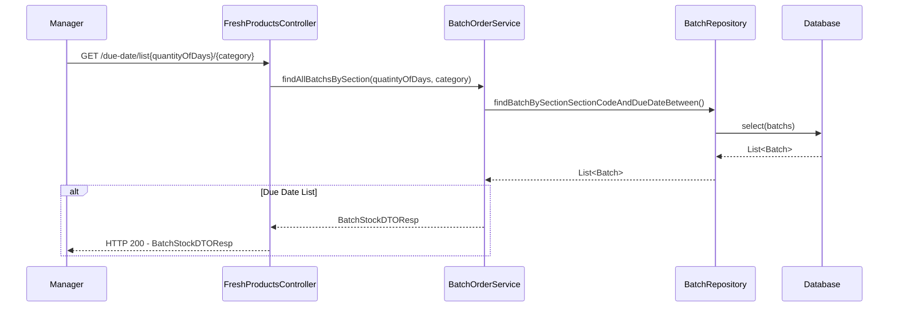